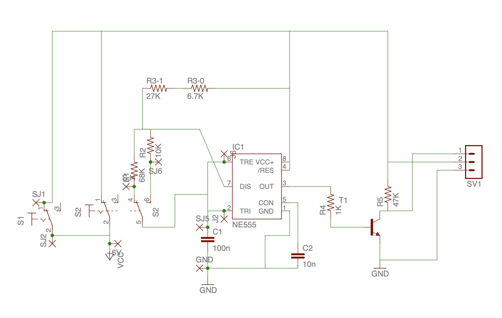

# 555 Build Instructions

This version uses the venerable 555 timer to output a pulse-width modulated signal to drive a servo to max/min positions. This is a great way to learn more about the 555 and results in a cheap mechanism to drive an extremely simple useless machine.

I built this version to learn more about 555s and wrap my head around PWM signaling. I can't say that I'm an expert in either of these things now, but this project definitely helped me grow!

Check the [enclosure readme](../enclosure/Enclosure_README.md) for details on building a laser-cut enclosure.

## Circuit

### Bill of Materials

* S1 SPDT No/NC Roller Lever Micro Switch ([Omron SS-5GL2](https://nl.rs-online.com/web/p/micro-switches/6822660) or similar)
* S2 DPDT Panel Mount Toggle Switch ([RS PRO 734-7022](https://nl.rs-online.com/web/p/toggle-switches/7347022))
* IC1 [NE555P 8-Pin PDIP](https://nl.rs-online.com/web/p/timer-circuits/8660199)
* R1 68K
* R2 10K
* R3-1 27K
* R3-2 6.7K
* R4 1K
* R5 47K
* C1 100nF
* C2 10nF
* T1 2N2222
* [4x AA battery holder](https://nl.rs-online.com/web/p/battery-holders/1854643)
* 4x AA  battery
* 1501MG Servo or similar
* 1x3 2.54 mm Pin Headers
* hookup wire

## Circuit Board

You can build this up on prototype strip board, or use the included mask for etching your own using ferric chloride or hydrogen peroxide and muriatic acid method at home. It's pretty easy to do and some of the new toner transfer products make it pretty easy to do. Check this [instructables from TechShopJim](https://www.instructables.com/Sponge-Ferric-Chloride-Method-Etch-Circuit-Bo/) for more details.

The provided circuit board mask is for a single sided circuit and requires a couple of jumpers (see the layout). The mask is reversed and intended to go on the **bottom** of the etched board. 

* [Circuit Mask A4](./circuit/UM-Driver-rv3.1-A4.pdf)
* [Circuit Mask US Letter](./circuit/UM-Driver-rv3.1-Letter.pdf)
* [Circuit Layout w/ components](./circuit/UM-Board_Layout.pdf)

## Assembly

The Servo should run anti-clockwise when the microswitch is CLOSED and the toggle  switch is flipped toward the door.  The servo should run clockwise when the toggle switch is flipped away from the door.  

1. Etch board on a single sided copper clad pcb
2. Drill out holes:
    * Component holes are 1mm
    * Mounting holes and wire routing hole (near GND) are 3mm
3. Solder in components as shown in the board layout
4. Add a jumper wire betwen J2 and J6
5. SW1 Micro Switch is wired as Normally Open (NO)
6. SW2 DPDT switch is wired as follows:
    * SJ1 - pin 1 (same position as pin 4)  
    * SJ2 - common
    * SJ4 - pin 4 (same position as pin 1)  
    * SJ5 - common  
    * SJ6 - pin 6 
7. The signal wire of the servo is connected to pin 3 of the header; this is the pin closest to the 2N2222 transistor

## References

*hackster.io* [Controlling Servo Motor Using 555](https://www.hackster.io/techmirtz/controlling-servo-motor-using-555-dd3a33)

*EngineersGarage*: [Servo Motor Control Using a 555 Timer IC](https://www.engineersgarage.com/servo-motor-control-using-555-timer-ic/)
