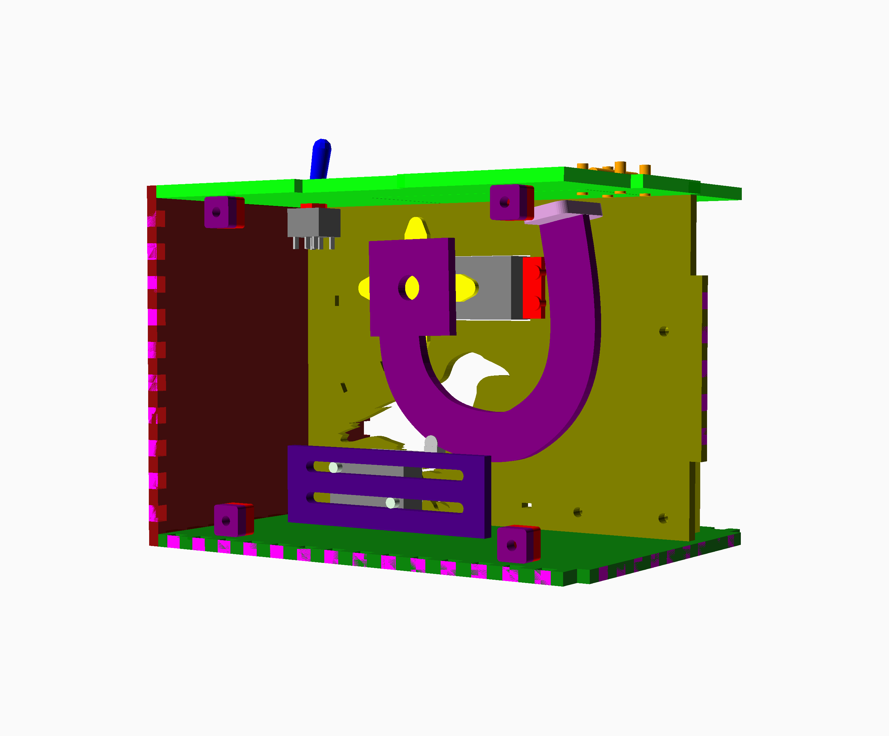
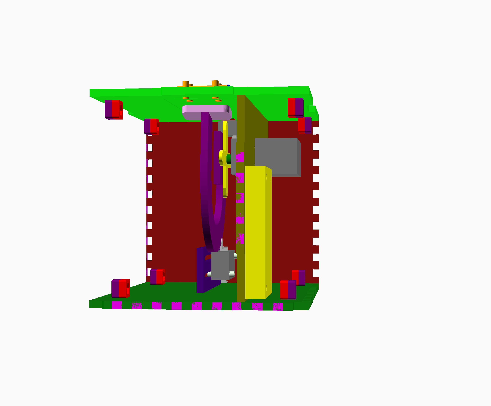
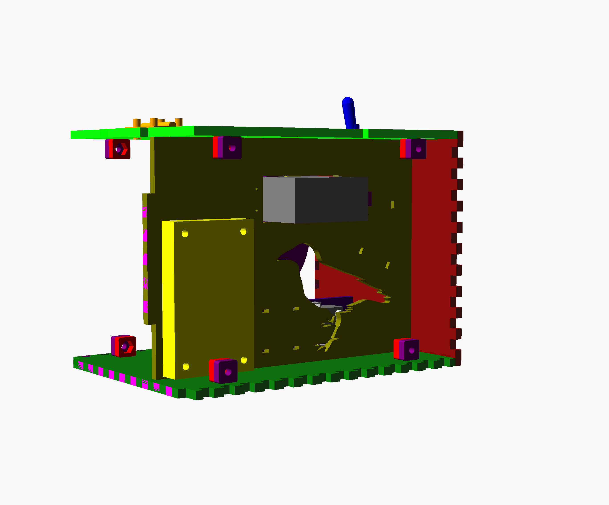
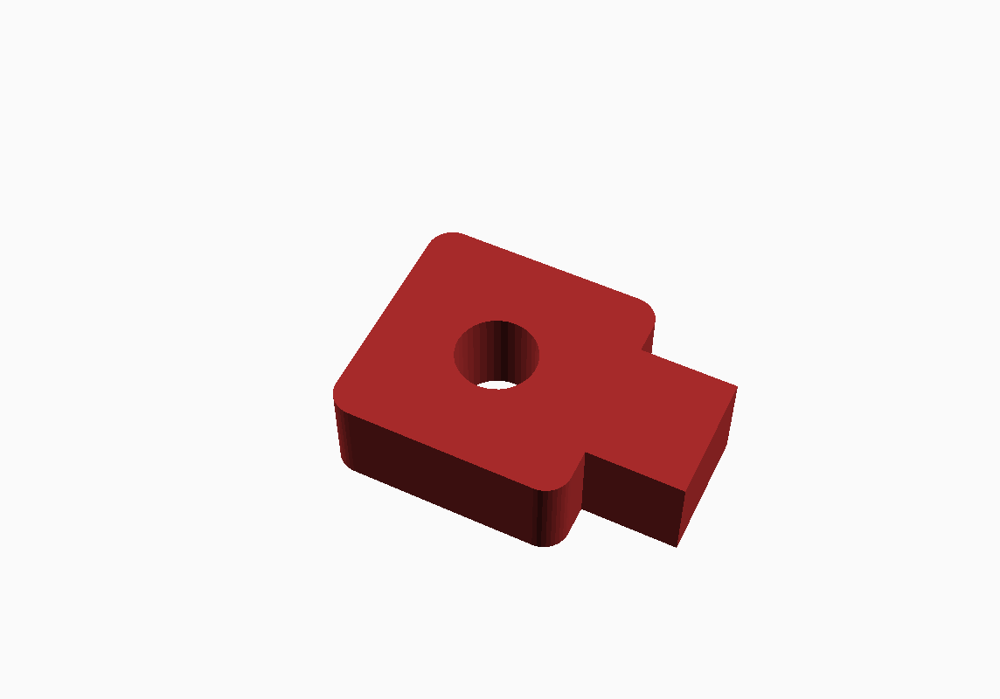
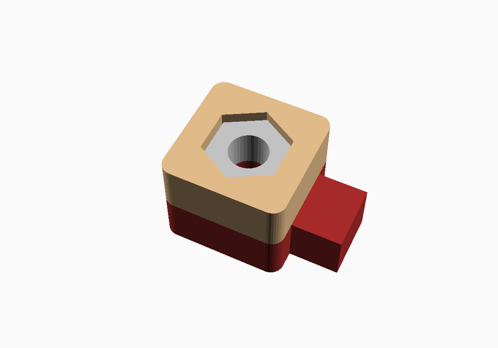
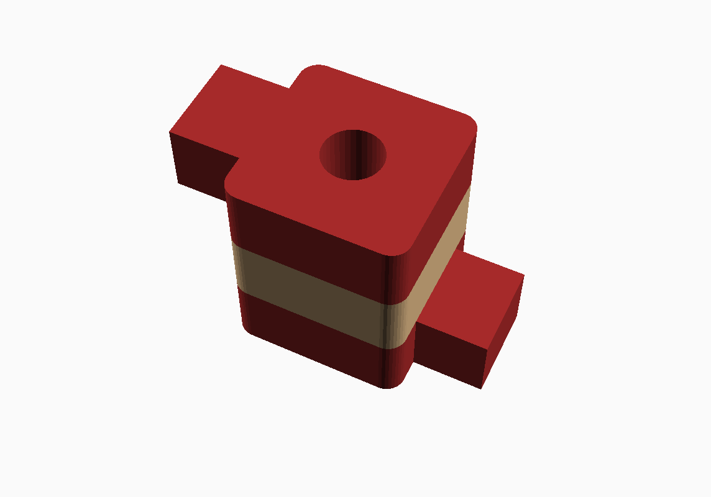
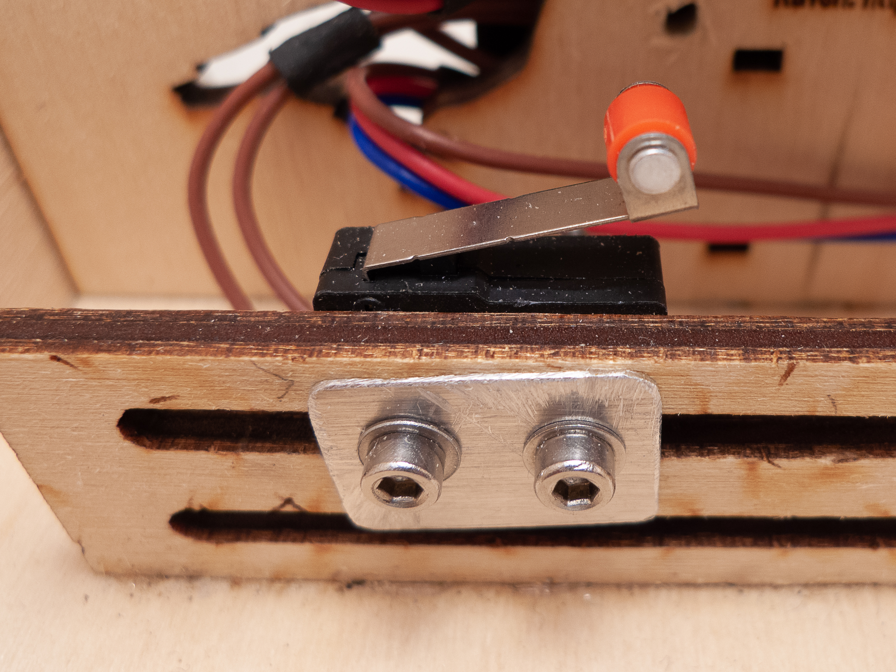
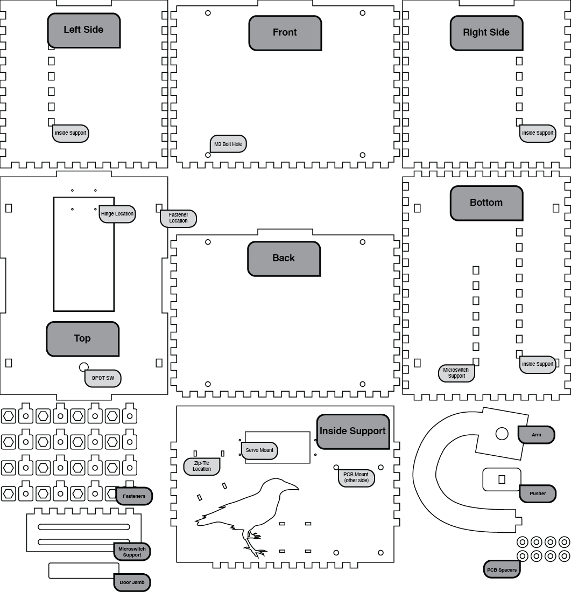

# Laser Cut Enclosure

Everything you need to build a laser cut enclosure is right here. The DFX and SVG versions are set up for a material thickness of ~4mm. There's even some nice artwork you can add to the outside. These instructions assume you have a working circuit and are ready to mount it in the box.

If you'd like to do some more customization or intend to use material that is not 4mm in thickness, the OpenSCAD files are designed to be hacked and modified. Check the [OpenSCAD Customization](#openscad-customization) section below for some guidance.

The lovely artwork on the outside of the box is courtesy of Patricia M. Ciuffo.

## OpenSCAD Customization

If you intend to use material that is not ~4mm in thickness, you **must** adjust the material thickness variable. You can easily access this by grabbing the [OpenSCAD](./OpenSCAD/) files and libraries. Open [`useless_machine.scad`](./OpenSCAD/useless_machine.scad) and use the *Customizer* to change the `thick` (Material Thickness) value in the *Project Setup* section.

Adjusting the thickness will recalculate the finger cuts along the edges and adjust some of the other design values. Major adjustments to the thickness may impact other values. Make sure you check the 3D model for interferences and other issues.

To generate a new DXF or SVG file switch to the 2D view (*Customizer > Project Setup > 2D*). You will need to render the project (F6 or *Design > Render*) and then export the DXF or SVG (*File > Export > SVG|DXF*).

*NOTES:*

* The 3D view deliberately leaves off several of the faces. This is just to make viewing easier. They are indeed accounted for in the 2D production.
* It is possible to 3D print this enclosure, but the finger joints will likely not fit together. You will need to do some sanding of your finished parts, or change up the algorithm that calculates the inside/outside dimensions.

## Case Files

| File | Notes |
|---|---|
| [useless_machine.dxf](./useless_machine-1.34.dxf) | Case outline only compatible with lasercutting software (material thickness ~4mm) |
| [useless_machine.svg](useless_machine-1.34.svg) | Case outline as a scallable vector graphic. Use this version if you'd like to add your own vector/raster artwork (material thickness ~4mm) |
| [useless_machine.zip](./useless_machine-SCAD.zip) | Customizable OpenSCAD code for generating SVG or DXF output. Use this version if you'd like to customize the dimensions or material thickess. |
| [useless_machine_artwork.zip](./usless_machine_artwork) | Adobe Illustrator vector graphics that can be used to decorate the outside of the enclosure. |
| [OpenSCAD Files](./OpenSCAD/)| All the required files for customizing your design and generating new DXF and SVG Files|

## Assembly

| | | |
|-|-|-|
|   FRONT| |   BACK|

### Materials

* 10x M3 Bolts
* 8x M3 Nuts
* 2x M2 or M3 Bolts and matching nuts
* Small hinge and bolts or screws 16mm between holes and 13mm from across faces
* PLA (wood) Glue
* Appropriate servos, switches, batteries, etc.

## Construction

The laser-cut faces should fit together logically. Use the illustrations and annotated image below to help identify the parts and orientations. 

Lay the bottom face in front of you so that the microswitch support is closest to you and oriented to the left side of the bottom plate. Slot the internal support into the bottom face. The crow should be facing to your right and should be directly in front of the microswitch support. Check the images above for reference.

Slot the microswitch support into the bottom plate. The support should be located in front of the bird cut-out.

Slot in the left and right sides. These are interchangeable unless you've decorated them.

Check the fit of the front, back and lid and then set the front, back and lid aside. Use a small amount of PLA glue to attach the supports and sides. DO NOT GLUE THE FRONT, BACK OR LID!

### Install PCB and Battery

If you are using the either of the supplied PCBs from this project, the holes should line up with the PCB Mount holes on the inside support. Use either wooden spacers or washers to raise the PCB a bit and then use M3 bolts and nuts to secure.

Depending on the mounting options for your battery pack, you can either use velcro, hot-glue or drill holes to mount it. 

Route any wires for the microswitch or DPDT switch through the bird cutout.

### Catch Construction

Build 4x LID catches using one fastener with a bolt hole, one tabbed fastener and an M3 bolt. Glue the two fastener pieces together, then glue the M3 nut into hexagonal hole. It helps to put a bolt through the nut to prevent the threads from filling with glue.
| | |
|-|-|
|| |

Build 3x BOTTOM catches using one fastener with a bolt hole, two tabbed fastener and an M3 bolt. Glue the two fastener pieces together, add an M3 nut into hexagonal hole then glue on the last tabbed fastener, but with the tab facing the opposite direction. These will be used in the fastener locations in the bottom face. Wait to glue these in until 

| | | |
|-|-|-|
|| ||

### Attach the Catches

Glue the catches into place on the lid using the method below. This method helps ensure that the catches are properly aligned with the bolt holes and the front and back faces will sit snugly.

1. Thread an M3 Bolt through the top two holes of the front and back faces
2. Loosely screw one LID catch onto the bolt so the nut is facing inwards
3. Starting with the front face, put a small dab of glue onto the two lid catches
4. Fit the face onto the base and seat all the fingers on the left and right sides
5. Orient the tabs on the LID catches so they are facing upwards
6. Place the lid on the box seating the glue-covered tabs into the fastener locations
7. Tighten the bolts so they are **finger** tight and ensure the tabs are fully seated in the lid
8. Allow the glue to dry
9. Repeat for the back face

Glue three BOTTOM catches into place on the base using the same method as the lid. Start with one side, then do the other. Depending on the thickness of your PCB, you will need to find the best possible solution for the catch directly in front of it.

### Install the Lid and Door Jamb

Using either small wood screws, or small bolts, attach the hinge to the top and the door in the lid. I added a bit of silver plastic from an anti-static bag using double stick tape to the back of the door to decrease the friction with the arm as it pushed open the door. This is optional.

If your lid does not close on its own, adding a small spring between the bolts of the hinge can help it snap back shut. A small spring out salvaged from a clicky ball-point pen worked great for this. This is optional.

To keep the lid from flopping too far inside the box, you will need to glue the door jamb to the underside of the lid. The jamb should be glued so the lip of the door opposite the hinge just rests on it.

### Install the Switches

Use the raven shaped hole in the internal wall to route your wires from the PCB side of the box to the larger space opposite the PCB. 

The DPDT switch is installed in the lid through the provided hole using the nuts supplied with the switch. If your switch rotates too much, consider adding some small pieces of wood on either side (see image above).

The SPDT micro switch is installed on the Microswitch Support using two bolts and nuts. Attach the switch on the inside of the support closest to the internal wall. Loosely attach the switch for now. It will need to be adjusted after the arm is installed.

### Install the Servo and Arm

Attach the arm to the servo horn (black or white plastic disk) supplied with the servo. Use small wood screws.  Glue the pusher face onto the arm using PLA glue.

Working from the side opposite the PCB, mount the servo so the horn (drive side) is on the same side as the microswitch. Screw the servo in place using the small wood screws supplied with the servo.

Rotate the servo clockwise until it stops. Turn it back anti-clockwise slightly less than 1/4 turn. Attach the arm and horn assembly to the servo using the screw supplied with the servo so that the arm is all the way retracted and just about touching the microswitch (see the image).

Manually rotate the arm and make sure that the pusher head can make it all the way to the switch and go just a bit further. If the arm cannot reach the switch, unmount the arm and turn the servo clockwise a few degrees. Attach the arm and try again. Repeat as needed.

### Adjust the Microswitch

For both the 555 and ItsyBitsy designs provided, when the arm touches the microswitch, it signals that the arm has returned *home*. For the 555 version, this disconnects the battery entirely. The ItsyBitsy version starts a countdown timer and after a preset time, disconnects a latching relay to disconnect the battery.

For both designs, the position of the limit switch is important. Limit switches come in a lot of variety with long levers, rollers and require a variety of force to switch. Slide the microswitch on the support left and right until you can find a position where the arm is completely inside the box **and** the switch is activated. 

As long as the arm isn't bottoming out and crashing into the bottom of the box, or hitting the limit of the servo, any position where the arm is entirely inside the box will work. Play with it until you find a solution you like.

### Close It Up

Tie up all your loose wires using zip ties or some twist-ties. Use the M3 bolts to close up the box and enjoy!

